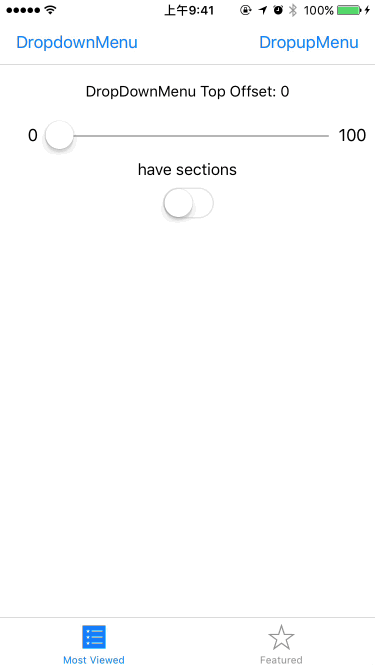

[](https://github.com/Carthage/Carthage)

 DropdownMenu is a dropdown menu for navigationController in Swift, It  can be associated in any please if have a navigationController
 
 

## Features
- **Only text cell**
- **Image and text cell**
- **Highlight cell**
- **Seleted cell**
- **Detail accessory cell**

## Requirements

- iOS 8.0
- Xcode 7.3+

## Communication

- If you **need help**, please add issues. or send Email to <zhangxaiolian1991@gmai.com>

## Installation

> **Embedded frameworks require a minimum deployment target of iOS 8

### Carthage

[Carthage](https://github.com/Carthage/Carthage) is a decentralized dependency manager that builds your dependencies and provides you with binary frameworks.

You can install Carthage with [Homebrew](http://brew.sh/) using the following command:

```bash
$ brew update
$ brew install carthage
```

To integrate DropdownMenu into your Xcode project using Carthage, specify it in your `Cartfile`:

    github "teambition/DropdownMenu"

Run `carthage update` to build the framework and drag the built `DropdownMenu.framework` into your Xcode project.


## Usage

### Import framework to your class

```swift
import DropdownMenu

```

### Add code for your action

```swift
func showMenu(sender: UIBarButtonItem) {
        let item1 = DropdownItem(title: "NO Image")
        let item2 = DropdownItem(image: UIImage(named: "file")!, title: "File")
        let item3 = DropdownItem(image: UIImage(named: "post")!, title: "Post", style: .Highlight)
        let item4 = DropdownItem(image: UIImage(named: "post")!, title: "Event", style: .Highlight, accessoryImage: UIImage(named: "accessory")!)

        let items = [item1, item2, item3, item4]
        let menuView = DropdownMenu(navigationController: navigationController!, items: items, selectedRow: selectedRow)
        menuView.delegate = self
        menuView.showMenu()
    }
```

### Handle delegate

```swift
extension ViewController: DropdownMenuDelegate {
    func dropdownMenu(dropdownMenu: DropdownMenu, didSelectRowAtIndexPath indexPath: NSIndexPath) {
        print("DropdownMenu didselect \(indexPath.row)")
    }
}
```

for detail, Please check the demo

## License

DropdownMenu is released under the MIT license. 

